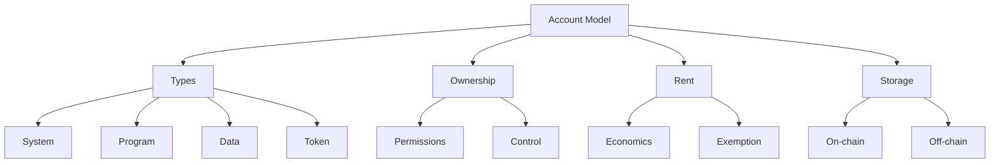

# 📱 Solana Account Model

## Overview

The Solana Account Model is a fundamental concept that defines how data and assets are stored and managed on the Solana blockchain. This section provides a comprehensive guide to understanding the account system.

## 📚 Contents

### [1. Account Types](1.solana_account_types.md)

Learn about the different types of accounts in Solana:

- System Accounts (SOL holdings)
- Program Accounts (Smart Contracts)
- Data Accounts (State Storage)
- Token Accounts (SPL Tokens)
- And more specialized accounts

### [2. Account Ownership](2.solana_account_ownership.md)

Understand how account ownership works:

- Owner Programs
- Permission Systems
- Account Control Mechanisms

### [3. Rent Economics](3.solana_rent_economics.md)

Explore Solana's storage cost model:

- Rent Calculation
- Rent Exemption
- Account Lifecycle

### [4. Data Storage](4.solana_data_storage.md)

Deep dive into data storage mechanisms:

- Account Data Structure
- Storage Optimization
- On-chain vs Off-chain Storage

## 🔑 Key Concepts

## 📖 Quick Reference

| Concept | Description |
|---------|------------|
| Account | Basic unit of storage in Solana |
| Owner | Program that controls the account |
| Rent | Cost of storing data on-chain |
| PDA | Program Derived Address for deterministic storage |

## 🎯 Learning Path

1. Start with Account Types to understand the basics
2. Move on to Account Ownership to learn about control
3. Study Rent Economics to understand costs
4. Explore Data Storage for implementation details

## 🔗 Related Resources

- [Solana Documentation](https://docs.solana.com/developing/programming-model/accounts)
- [Solana Cookbook](https://solanacookbook.com/references/accounts.html)
- [SPL Token Standard](https://spl.solana.com/token)
