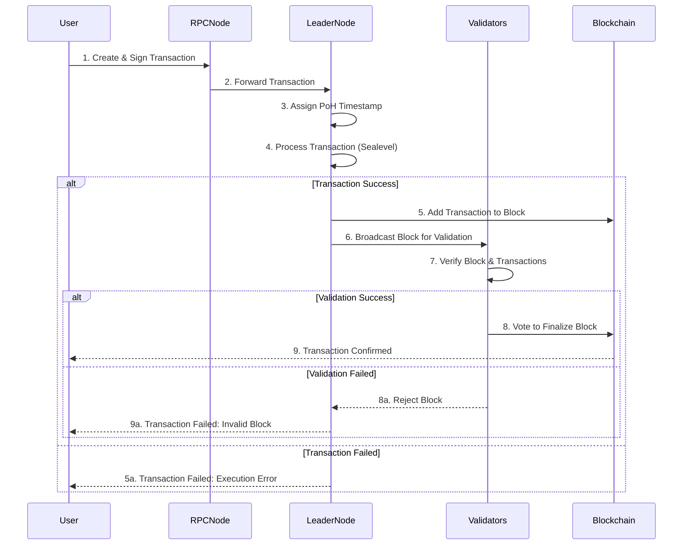

# Solana Transaction Processing

Here’s a step-by-step diagram of how transactions are processed in Solana:

## Steps Explained

1. **User**: Creates and signs a transaction (e.g., sending SOL).
2. **RPC Node**: Receives the transaction and forwards it to the leader node.
3. **Leader Node**: Uses **Proof of History (PoH)** to timestamp the transaction.
4. **Leader Node**: Processes the transaction in parallel using **Sealevel**.
5. **Leader Node**: If successful, adds the transaction to a new block. If failed, returns error to user.
6. **Leader Node**: Broadcasts the block to other validators for verification.
7. **Validators**: Check the block and transactions for validity.
8. **Validators**: If valid, vote to finalize the block. If invalid, reject the block.
9. **Blockchain**: Confirms the transaction to the user or returns failure reason.

## Error Scenarios

- **Execution Error**: Transaction fails during processing (e.g., insufficient funds, invalid instruction)
- **Validation Error**: Block is rejected by validators (e.g., invalid signatures, double spend)
- **Timeout**: Transaction is dropped if not included in a block within a certain time
- **Network Error**: Transaction fails to reach the leader node or validators
