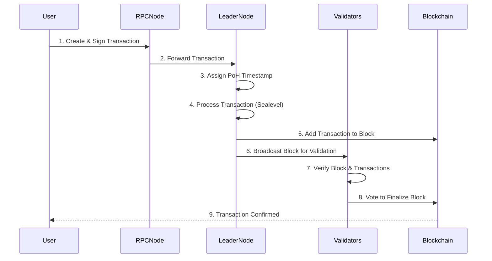

# Solana Transaction Processing

Here’s a step-by-step diagram of how transactions are processed in Solana:

## Steps Explained

1. **User**: Creates and signs a transaction (e.g., sending SOL).
2. **RPC Node**: Receives the transaction and forwards it to the leader node.
3. **Leader Node**: Uses **Proof of History (PoH)** to timestamp the transaction.
4. **Leader Node**: Processes the transaction in parallel using **Sealevel**.
5. **Leader Node**: Adds the transaction to a new block.
6. **Leader Node**: Broadcasts the block to other validators for verification.
7. **Validators**: Check the block and transactions for validity.
8. **Validators**: Vote to finalize the block and add it to the blockchain.
9. **Blockchain**: Confirms the transaction to the user
