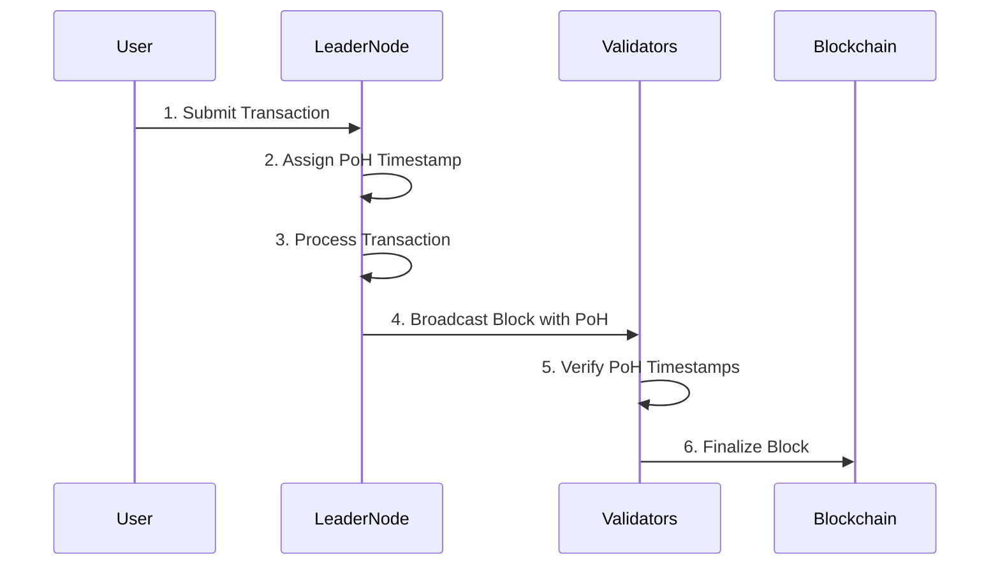

# Understanding Proof of History (PoH) in Solana

**Proof of History (PoH)** is a unique innovation in Solana that acts as a cryptographic clock for the blockchain. It's not a consensus mechanism itself but works alongside **Proof of Stake (PoS)** to make Solana extremely fast and efficient.

---

## **What is Proof of History?**

Proof of History is a way to prove that an event occurred at a specific moment in time. It creates a verifiable timeline of events, allowing the network to agree on the order of transactions without constant communication between nodes.

---

## **How Proof of History Works**

1. **Timestamps**: Each transaction is assigned a cryptographic timestamp.
2. **Verifiable Delay Function (VDF)**: A mathematical function ensures that time has passed between events.
3. **Ordering**: Transactions are ordered based on their timestamps, eliminating the need for validators to agree on the order.

---

## **Why Proof of History is Important**

- **Speed**: PoH allows Solana to process transactions in parallel, achieving **up to 65,000 transactions per second**.
- **Efficiency**: Validators don't need to constantly communicate about transaction order, reducing overhead.
- **Scalability**: PoH enables Solana to handle more users and transactions without slowing down.

---

## **Proof of History in Action**

Here's a Mermaid diagram to visualize how PoH works:

### **Steps Explained:**

1. **User**: Submits a transaction to the leader node.
2. **Leader Node**: Assigns a **PoH timestamp** to the transaction.
3. **Leader Node**: Processes the transaction and includes it in a block.
4. **Leader Node**: Broadcasts the block with PoH timestamps to validators.
5. **Validators**: Verify the PoH timestamps to ensure the order of transactions is correct.
6. **Blockchain**: Finalizes the block and adds it to the chain.

---

## **Key Benefits of Proof of History**

1. **Fast Transaction Processing**: PoH enables parallel processing, making Solana one of the fastest blockchains.
2. **Low Latency**: Transactions are confirmed in **400 milliseconds** on average.
3. **Decentralization**: PoH reduces the need for validators to communicate, making the network more decentralized.

---

## **Example Use Case**

Imagine you’re sending SOL to a friend:

1. Your transaction is timestamped using PoH.
2. The leader node processes it in parallel with other transactions.
3. Validators verify the PoH timestamp and confirm the transaction.
4. The transaction is finalized in less than a second!

---

## **Conclusion**

Proof of History is a game-changer for blockchain technology. It allows Solana to achieve unprecedented speed and scalability while maintaining security and decentralization. By acting as a cryptographic clock, PoH ensures that transactions are processed quickly and efficiently.