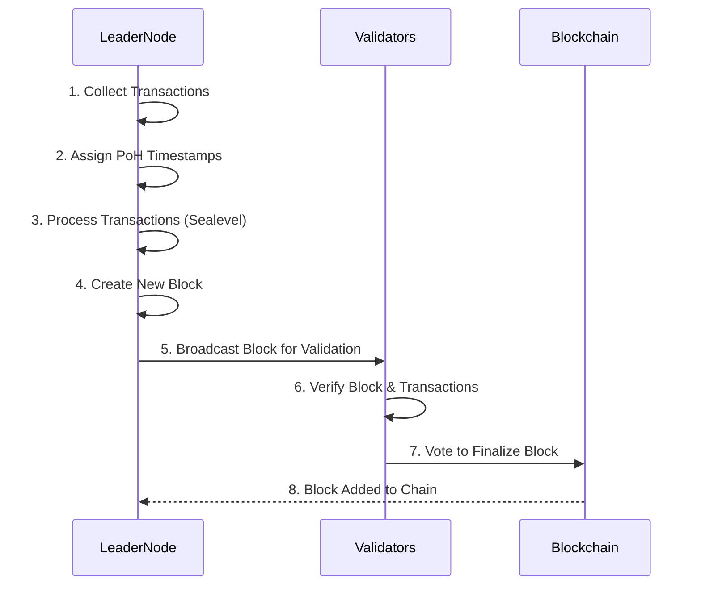

# Solana Block Production

Here's a step-by-step diagram of how blocks are produced in Solana:

## Steps Explained

1. **Leader Node**: Collects transactions from users and other nodes.
2. **Leader Node**: Assigns **Proof of History (PoH)** timestamps to each transaction.
3. **Leader Node**: Processes transactions in parallel using **Sealevel**.
4. **Leader Node**: Creates a new block containing the transactions and PoH timestamps.
5. **Leader Node**: Broadcasts the block to other validators for verification.
6. **Validators**: Check the block and transactions for validity.
7. **Validators**: Vote to finalize the block and add it to the blockchain.
8. **Blockchain**: Confirms the block and adds it to the chain.

---

### Key Features of Solana’s Block Production

- **Fast Block Times**: New blocks are created every **400 milliseconds**.
- **High Throughput**: Solana can handle **up to 65,000 transactions per second**.
- **Parallel Processing**: Transactions are processed in parallel using **Sealevel**.
- **Proof of History**: PoH ensures quick and efficient ordering of transactions.
