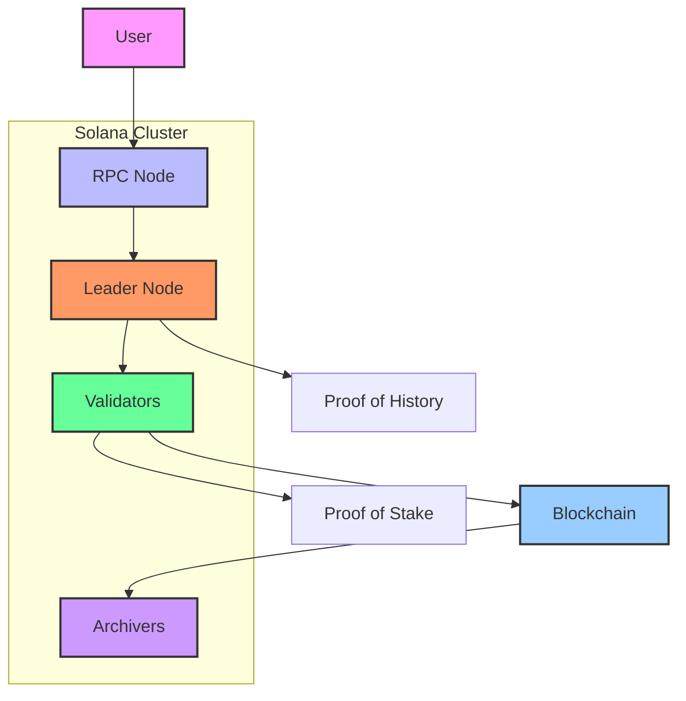

# Solana Cluster

A Solana cluster is a group of nodes that work together to run the Solana blockchain. Here’s how it works: 

### **Steps Explained:**
1. **User**: Sends a transaction to an RPC node.
2. **RPC Node**: Forwards the transaction to the leader node.
3. **Leader Node**: Processes the transaction using **Proof of History (PoH)** and creates a block.
4. **Validators**: Verify the block and vote to finalize it using **Proof of Stake (PoS)**.
5. **Blockchain**: Adds the block to the chain.
6. **Archivers**: Store historical data for future reference.

---

### **Key Features of a Solana Cluster:**
- **Proof of History (PoH)**: Ensures quick ordering of transactions.
- **Proof of Stake (PoS)**: Secures the network and incentivizes validators.
- **Parallel Processing**: Handles multiple transactions at once using **Sealevel**.
- **Decentralization**: Many nodes work together to keep the network secure and fair.

---

### **How to Use:**
1. Save the content above as a file named `solana_cluster.md`.
2. Open it in a Markdown editor/viewer that supports Mermaid diagrams (e.g., VS Code with the Mermaid extension, GitHub, or Obsidian).
3. You’ll see the diagram and the explanation in a clean, readable format!

Let me know if you need further assistance! 😊